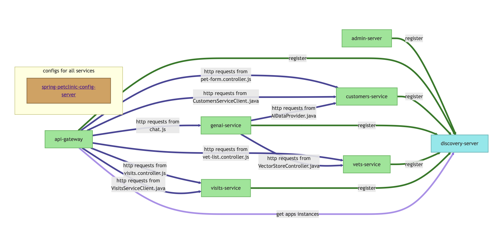

# Microservice interactions analyzing tool
A tool for building diagrams of microservices' interactions based on source code of the input project. Uses CodeQL engine for collecting data about project, Python scripts for processing it and Mermaid for showing the results.

## How to run
Clone this repo:
```bash
    git clone git@github.com:p1onerka/microservices-diagrams.git
```
Open the project:
```bash
    cd microservices-diagrams
```
Run the project:
```bash
    ./generate-diagram.sh \<project_name\> \<project_dir\> \<java_db_name\> \<javascript_db_name\>
```

## How to run tests
Install dependencies:
```bash
    pip install -r requirements.txt
```
And then run tests:
```bash
    python -m pytest
```

## Example diagram
Here is the example of tool's output with [this](https://github.com/spring-petclinic/spring-petclinic-microservices) project as input:

The source code for this diagram can be found in `tests/test_complex_diag_drawing.py`.

## Docs
Project documentation is availible [here](https://p1onerka.github.io/microservices-diagrams/index.html).

## Contacts
[Ksenia Kotelnikova](https://github.com/p1onerka)
